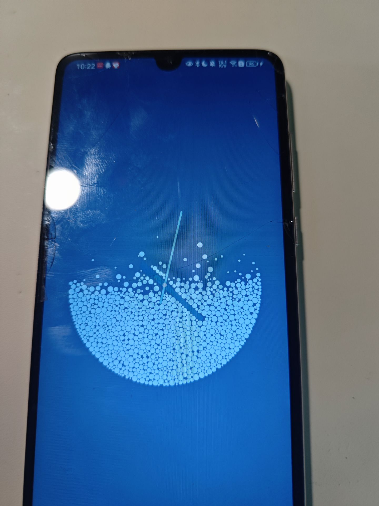
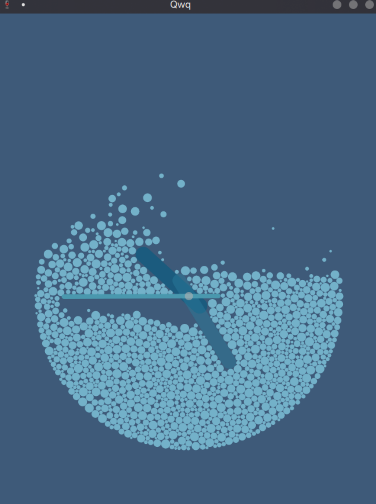

<h1>Clocky</h1>

小红书上看到的一个[IDEA](https://www.xiaohongshu.com/explore/681c7ae700000000230147fd?xsec_token=ABoqBEjU0ooGYeiafBoBJgOq3wvyFltoeyCNIBEs0KwOk=) 然后就复刻了一个lol

配色乱选的（嗯）

`rapier`物理引擎、`winit`窗口管理、`wgpu`与`vello`图像渲染

同时可以编译到`android`端

咱就随便乱玩玩 QwQ

 

     
     

